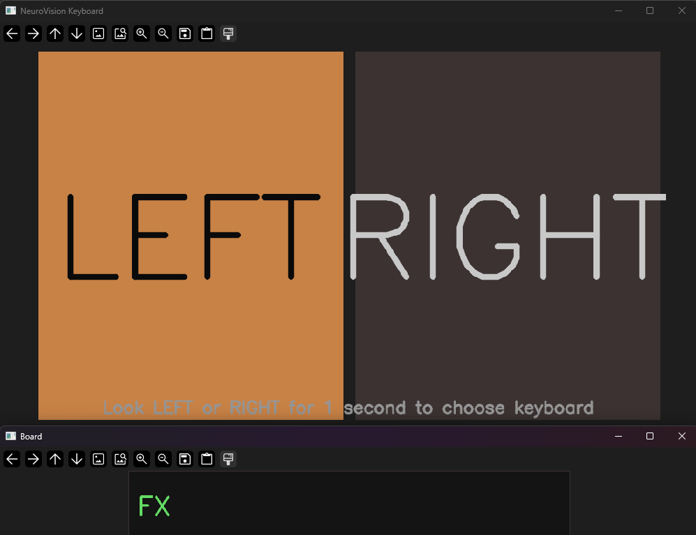
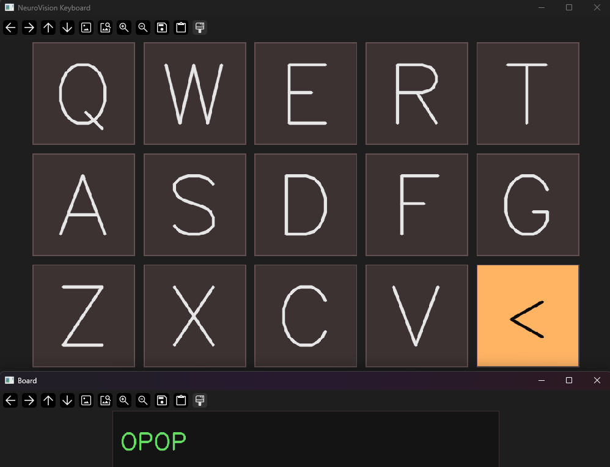
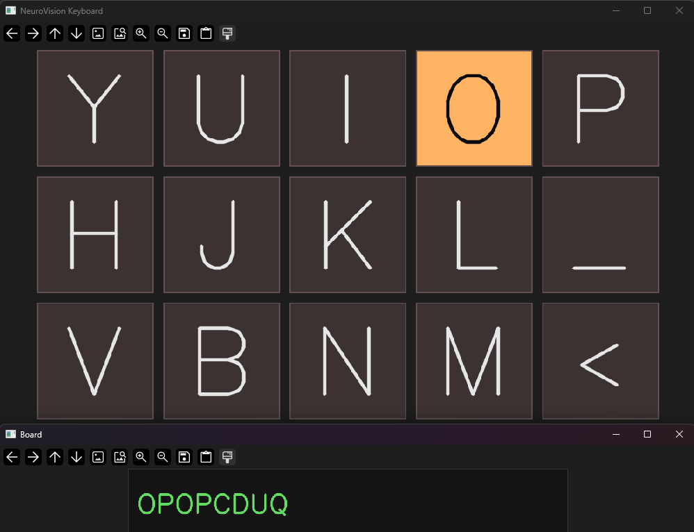
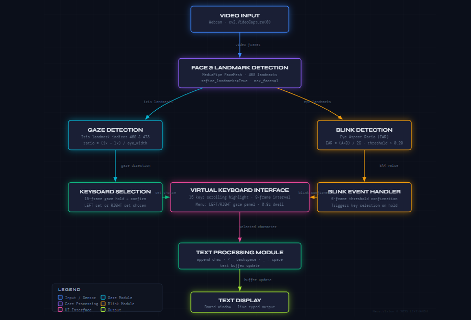

# 🧠 NeuroVision — Eye-Gaze Virtual Keyboard

> Type using only your **eyes** — gaze left or right to pick a keyboard half, then blink to select a letter.  
> Built with MediaPipe FaceMesh, Python, and OpenCV. No hands required.

---

## 📸 Screenshots

| Menu Selection | Keyboard — Left Set | Keyboard — Right Set |
|---|---|---|
|  |  |  |

---

## 🧩 Block Diagram



---

## ⚙️ How It Works

1. Your **webcam** captures a live video feed.
2. **MediaPipe FaceMesh** detects 468 facial landmarks in real-time.
3. **Iris position** is tracked to detect gaze direction (left or right).
4. A **LEFT / RIGHT menu** appears — hold your gaze on one side for ~1 second to pick that half of the keyboard.
5. The keyboard **scrolls through letters** one at a time, highlighting each key.
6. **Blink** when your target letter is highlighted — hold the blink for ~6 frames to type it.
7. `<` = Backspace, `_` = Space.
8. Typed text appears live on the **Board** window below.

---

## 🖥️ Software Setup

### 1. Clone the Repository

```bash
git clone https://github.com/LIKTHANSH/NeuroVision_KeyBoard.git
cd NeuroVision_KeyBoard
```

### 2. Install Dependencies

Make sure you have **Python 3.8+** installed.

```bash
pip install -r requirements.txt
```

### 3. Run

```bash
python software/virtual_keyboard.py
```

> **Note:** Sound files (`sound.wav`, `left.wav`, `right.wav`) must be in the `sounds/` folder.  
> If they are missing, the program still runs — just without audio feedback.

---

## ⌨️ Keyboard Layout

| Left Set | Right Set |
|---|---|
| Q W E R T | Y U I O P |
| A S D F G | H J K L _ |
| Z X C V < | V B N M < |

- `<` → Backspace  
- `_` → Space

---

## 📁 Project Structure

```
NeuroVision_KeyBoard/
├── software/
│   └── virtual_keyboard.py   # Main Python script
├── sounds/
│   ├── sound.wav             # Key press sound
│   ├── left.wav              # Left keyboard selected
│   └── right.wav            # Right keyboard selected
├── docs/
│   └── block_diagram.png    # System block diagram
├── requirements.txt
├── .gitignore
└── README.md
```

---

## 📦 Requirements

- `opencv-python` — Video capture and display
- `mediapipe` — FaceMesh + iris landmark detection
- `numpy` — Array operations
- `pyglet` — Audio playback

See [`requirements.txt`](requirements.txt) for versions.

---

## 🧠 About NeuroVision

NeuroVision is an assistive technology system for people with motor impairments.

| Module | Repository |
|---|---|
| 👁️ Virtual Keyboard | **This repo** |
| 🏠 Home Appliance Control | [NeuroVision](https://github.com/LIKTHANSH/NeuroVision) |

---

## 📄 License

This project is for educational and research purposes.  
© 2025 LIKTHANSH — All rights reserved.
